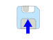
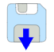
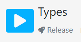
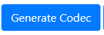

# Communicating StateCharts (CSC)

**Presented paper at ITiCSE 2025:** [Communicating StateCharts (CSC)](https://dl.acm.org/doi/10.1145/3724389.3731259)

**Authors:** Sheida Emdadi, Spencer Smith, Christopher Kumar Anand

## Table of Contents
- [Introduction](#introduction)
- [Try at Home](#try-at-home)
    -  [CSC Examples](#csc-examples)
    -  [Online IDE Manual](#online-ide-manual)

## Introduction
We propose a new concurrency framework called *Communicating StateCharts (CSC)* with the potential to simplify the teaching concurrency to beginners. CSC was designed based on five main principles chosen to reduce barriers for beginners: using software visualization, Model-Driven Development (MDD), pure functions, Separation of Concerns (SoC), and---most importantly---raising the level of abstraction. To address these principles, we adopted features from existing concurrency models (i.e., process calculi and the actor model) in alignment with the principles, resulting in CSC's atomic statecharts, communicating through channels. We also present *CSCDraw*, a visual MDD tool to support CSC.

A detailed description of CSC and CSCDraw can be found in the [master's thesis](http://hdl.handle.net/11375/31620) of Sheida Emdadi.

## Try at Home!

To try designing a multi-user application with our visual model-driven development tool, CSCDraw, please:

1. download the [Try at Home Package](TryAtHome.rar) locally on your device. 
2. click on CSCDraw.html on your device to open it with your browser.

Then, you can either
- try using our pre-designed multi-player games by
    1. clicking on the upload button , and then 
    2. choosing one of the pre-designed CSCs from the [Try at Home Package](TryAtHome.rar), such as [Party Game](PartyGame\PartyGame.json) or [Lights Game](PartyGame\PartyGame.json). 
        - To find a detailed decription of the examples, please consult the [CSC Examples](#csc-examples) section.
    3. generating code based on the designed models by clicking on the code generator . 
    4. copying the generated code by `CTRL/CMD + C`.

, or

- start designing your own multi-user applications, by
    1. clicking on a statechart and navigating to the SCEditing mode.
    2. going back to the overall mode and designing the other statechart. 
        - Navigation from SCEditing mode to the Overall mode is possible by clicking on the navigator button .

    3. connecting messages to the channels in the Overall mode.
    4. generating code based on the designed models by clicking on the code generator . 
    5. copying the generated code by `CTRL/CMD + C`.
    6. saving the designed model locally by clicking on the save button  (optional).

To compile the generated code, please use our online IDE, [STaBL.rocks](https://stabl.rocks/).
- Section [Online IDE Manual](#online-ide-manual) provides a detailed explanation of how to run your generated code on our online IDE.

### CSC Examples

### Online IDE Manual

If you don't have an account on [STaBL.rocks](https://stabl.rocks/), please contact either [Sheida](emdadibz@mcmaster.ca) or [Dr. Anand](anandc@mcmaster.ca).

After generating the code in CSCDraw, please log into your account on [STaBL.rocks](https://stabl.rocks/), and then follow these steps:
1. Choose `My Projects` tab.
2. Click on the `+New` button.
3. Create a project using `TEASync` template.
4. Open your created project.
5. Open the Types module.
6. Paste the generated code.
7. Take out the code that belongs to the Main module. 
    - Look for this comment `--Put this code into the Main module.` in the generated code, then select and cut the code from this comment (by `CTRL/CMD + X`).
8. Click on the `Release button in the Types module .
9. In your Project's page (where you can see the Main and Types modules), click on the `Generate Codec` button .
    - If the encoders and decoders are successfully generated, you will see a confirmation like this:
        `Successfully generated new Codec.Decoders and Codec.Encoders modules.`
10. Open the Main module.
11. Paste the rest of the generated code.
12. Click on the compile button on the left top corner , and see the output on the right pane.

